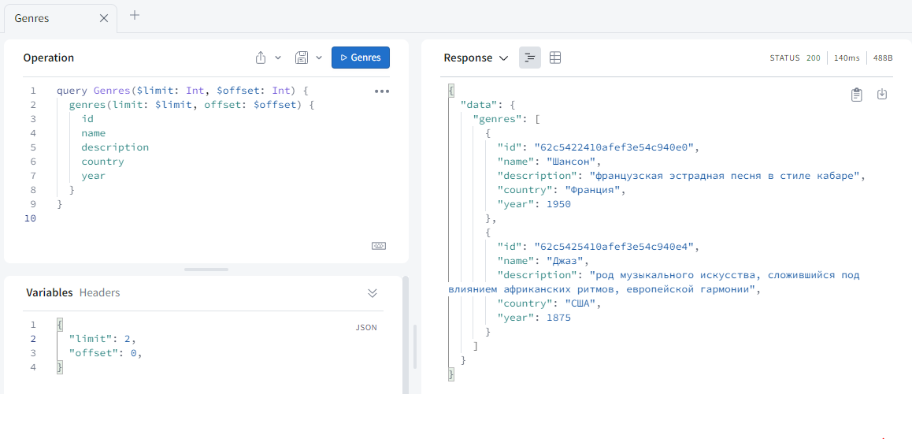
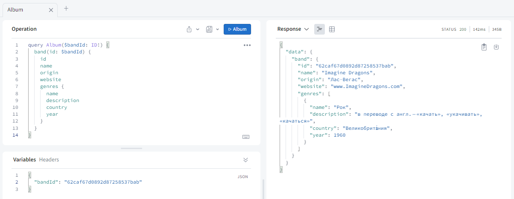
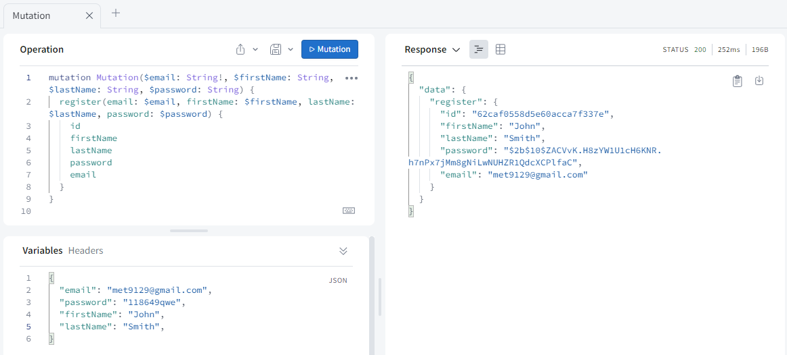
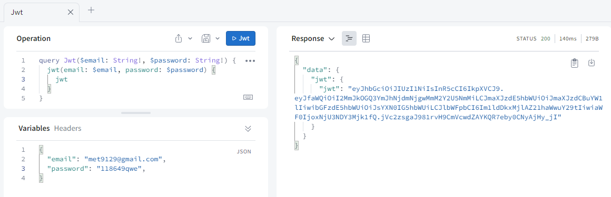
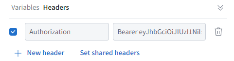
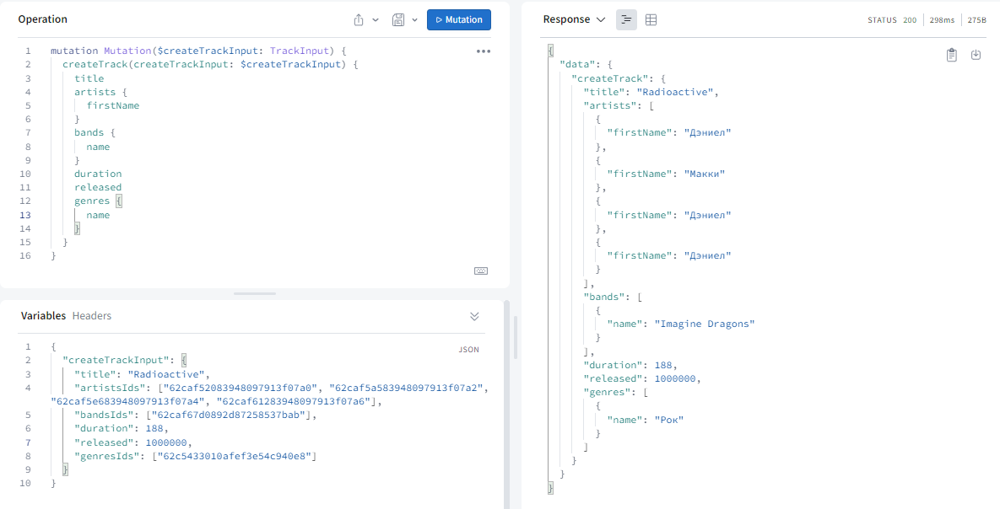
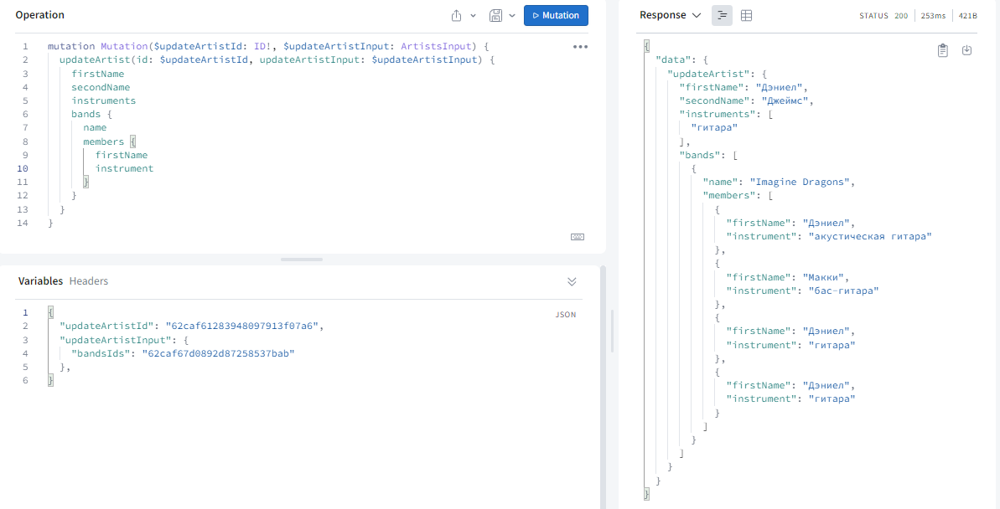
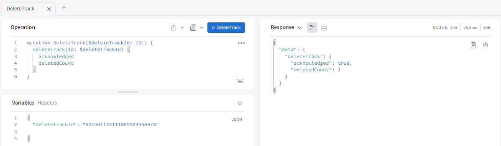
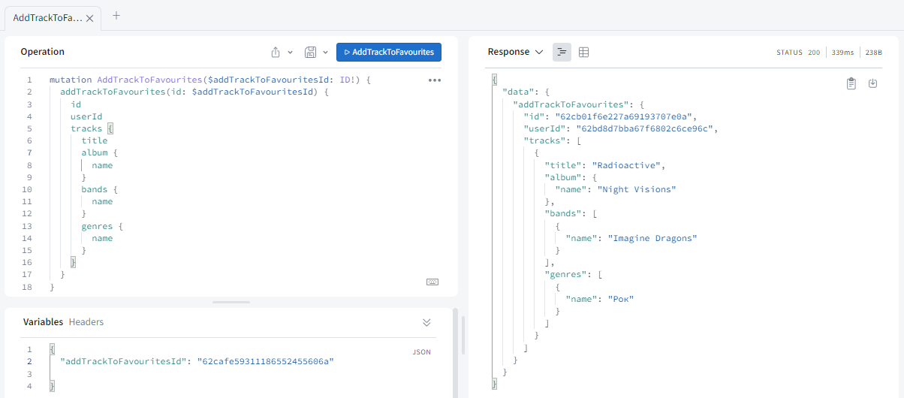

# Graphql Service


## Run application

#### 1. Installation

1. Clone repo

```bash
git clone https://github.com/taleatg/graphql-service.git
cd graphql-service
git checkout develop
```
2. Install the dependencies
```bash
npm install
```

#### 2. Rename

* rename .env.example to .env

#### 3. Run app

Development:
```bash
npm run start:dev
```

Production:
```bash
npm run start
```

#### 4. Run services

* Follow the link to start the services [Musicify microservices](https://github.com/rolling-scopes-school/node-graphql-service)

#### 5. Open  Apollo Studio Explorer

* Open your browser and follow the link http://localhost:3000/
* Click on the "Query your server" button


## Examples of how the app works

### 1. Queries

**1.1 Get all items of the selected type**



**1.2 Get item by id**



### 2. Mutation

**2.1 Register**

* Create a new user



* Get token



* Copy this jwt-token and add it to the headers



**2.2 Add a new item**



**2.3 Update item by id**



**2.4 Delete item by id**



**2.5 Add track to favourites**


